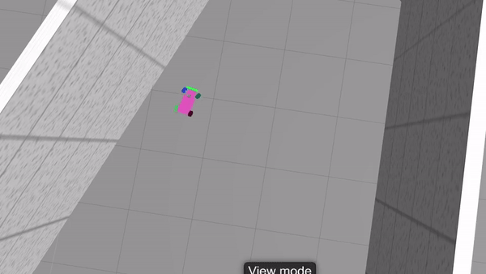

The goal of this project is to provide an easy-to-use framework that will allow to simulate a training of a self-driving car using OpenAI Gym, ROS and Gazebo. The project is based on openai_ros package. This package implements an architecture that was proposed by The Construct team.

# Software requirements #
* Ubuntu 18.04 or Windows WSL Ubuntu 18.04
* Python 2.7
* Tenserflow CPU or GPU

# Installation #
### ROS Melodic for Ubuntu 18.04 ###
Full instructions can be found [here](http://wiki.ros.org/melodic/Installation/Ubuntu)
```bash
sudo sh -c 'echo "deb http://packages.ros.org/ros/ubuntu $(lsb_release -sc) main" > /etc/apt/sources.list.d/ros-latest.list'
sudo apt-key adv --keyserver hkp://ha.pool.sks-keyservers.net:80 --recv-key 421C365BD9FF1F717815A3895523BAEEB01FA116
sudo apt update
sudo apt install ros-melodic-desktop-full
sudo rosdep init
rosdep update
echo "source /opt/ros/melodic/setup.bash" >> ~/.bashrc
source /opt/ros/melodic/setup.bash

sudo apt install ros-melodic-ackermann-msgs
sudo apt install ros-melodic-effort-controllers
sudo apt install ros-melodic-joy
sudo apt install ros-melodic-tf2-sensor-msgs
```

### Creating catkin workspace ###
```bash
cd ~
mkdir catkin_ws
cd catkin_ws/
mkdir src
cd src/
```

### MIT Racecar ###
```bash
cd ~/catkin_ws/src/
git clone https://github.com/mit-racecar/racecar.git
git clone https://github.com/mit-racecar/racecar-simulator.git
```

### openai_ros ###
[openai_ros](http://wiki.ros.org/openai_ros) package provides OpenAI Gym environments which allows to compare Reinforcement Learning algorithms by providing a common API.
```bash
git clone https://bitbucket.org/theconstructcore/openai_ros.git
```

### Environment ###
This project implements openai_ros API for MIT Racecar robot.
```bash
git clone https://github.com/karray/neuroracer.git
````
```bash
cd ~/catkin_ws
catkin_make
```

The following python packages are required
```bash
sudo pip install tensorflow gym keras
````


# Usage #
After this MIT ROS-package and this project have to be started in their own terminals.
```bash
source ~/catkin_ws/devel/setup.bash
roslaunch racecar_gazebo racecar_tunnel.launch
```

```bash
source ~/catkin_ws/devel/setup.bash 
roslaunch neuroracer_gym_rl qlearning.launch
```
# WSL and headless setup #
Sometimes headless set up is needed. For example, when there is only ssh access to the server or if the server runs on Windows.

Headless set up has a couple of special requirements. In order to get the camera rendering a view,  you will need an xserver running. This can be achieved in several ways. The universal solution is Xvfb.

### Xvfb ###
>Xvfb or X virtual framebuffer is a display server implementing the X11 display server protocol. In contrast to other display servers, Xvfb performs all graphical operations in virtual memory without showing any screen output
>
>https://en.wikipedia.org/wiki/Xvfb

First install xvfb
```bash
sudo apt install xvfb
```
Then start the project
```bash

```

### Gzweb ###
Gzweb can be optionally installed
>Gzweb is a WebGL client for Gazebo. Like gzclient, it's a front-end graphical interface to gzserver and provides visualization of the simulation. However, Gzweb is a thin client in comparison, and lets you interact with the simulation from the comfort of a web browser. This means cross-platform support, minimal client-side installation, and support for mobile devices.
>
>http://gazebosim.org/gzweb.html

```bash
xvfb-run -s "-screen 0 640x480x24" npm run deploy --- -t
```

# neuroracer_gym


windows xserver for camera

process has died exit code -9: The script needed too much memory

laser bug.

sumulation start delay
