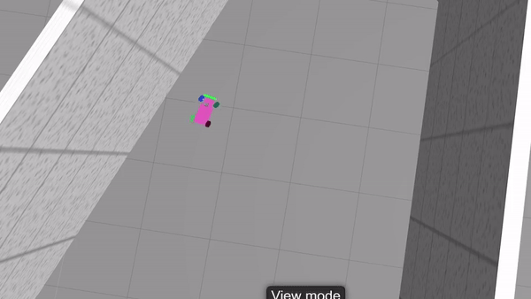

The goal of this project is to provide an easy-to-use framework that will allow to simulate a training of a self-driving car using OpenAI Gym, ROS and Gazebo. The project is based on openai_ros package. This package implements an architecture that was proposed by The Construct team.

# Software requirements #
* Ubuntu 18.04 or Windows WSL Ubuntu 18.04
* Python 2.7 and pip2
* Tensorflow CPU or GPU

# Installation #
The whole setup can be found in [setup.sh](docker/setup.sh) which is used to setup docker ([goto docker section](#Docker)) which is the simplest way to launch the simulation.

### ROS Melodic ###
Official instructions can be found [here](http://wiki.ros.org/melodic/Installation/Ubuntu)
```bash
chmod +x ./docker/install_ros.s
./docker/install_ros.sh
```
[install_ros.sh](docker/install_ros.sh)


### Catkin workspace ###
Creating `catkin_ws` directory, cloning and building all projects:
```bash
chmod +x ./docker/clone_build.sh
./docker/clone_build.sh <path/to/home_dir>
```
[clone_build.sh](docker/clone_build.sh)


### Python packages ###
```bash
pip install -U -r ./docker/requirements.txt
````
[requirements.txt](docker/requirements.txt)


# Start training #
Start MIT racecar simulation in its own terminal:
```bash
source ~/<catkin_ws>/devel/setup.bash
roslaunch racecar_gazebo racecar_tunnel.launch
```

Start training in the second terminal:
```bash
source ~/catkin_ws/devel/setup.bash 
roslaunch neuroracer_gym_rl start.launch agent:=<agent name>
```
There are 2 implemented agents: `dqn` and `double_dqn`.


Note: if you are getting `Exception sending a message` error, you should set the `IGN_IP` environment variable ([details](http://answers.gazebosim.org/question/21103/exception-sending-a-message/?answer=22276#post-id-22276)) before launching ros-packages:
```bash
export IGN_IP=127.0.0.1
```
# WSL and headless setup #
Sometimes headless setup is needed. For example, when there is only ssh access to the server or if the server runs on Windows.

### Xvfb ###
Headless setup has a couple of special requirements. In order to get the camera rendering a view, you will need an xserver running. This can be achieved in several ways. The universal solution is Xvfb.

>Xvfb or X virtual framebuffer is a display server implementing the X11 display server protocol. In contrast to other display servers, Xvfb performs all graphical operations in virtual memory without showing any screen output.
>[wikipedia](https://en.wikipedia.org/wiki/Xvfb)
```bash
sudo apt install xvfb
```

### Gazebo Web ###
>Gzweb is a WebGL client for Gazebo. Like gzclient, it's a front-end graphical interface to gzserver and provides visualization of the simulation. However, Gzweb is a thin client in comparison, and lets you interact with the simulation from the comfort of a web browser. This means cross-platform support, minimal client-side installation, and support for mobile devices.
>[Gzweb](http://gazebosim.org/gzweb.html)

```bash
chmod +x ./docker/install_gzweb.sh
./docker/install_gzweb.sh path/to/home_dir
```
[install_gzweb.sh](docker/install_gzweb.sh)


# Docker #
Just pull the image:
```bash
docker pull karay/neuroracer
```

and run it with following params:
```bash
docker run -d --runtime=nvidia -p 8080:8080 -p 8888:8888 karay/neuroracer
```
Where `http://localhost:8080` is Gazebo Web and `http://localhost:8888` is Jupyter Lab. There is also an example notebook:
http://localhost:8888/lab/tree/catkin_ws/src/neuroracer/q_learning.ipynb

Note: This image is setup for CUDA 10 and Tensorflow GPU. So `docker-ce` and [nvidia-docker2](https://github.com/nvidia/nvidia-docker/wiki/Installation-(version-2.0)) are required.


<!---
windows xserver for camera
process has died exit code -9: The script needed too much memory
laser bug.
simulation start delay
--->
