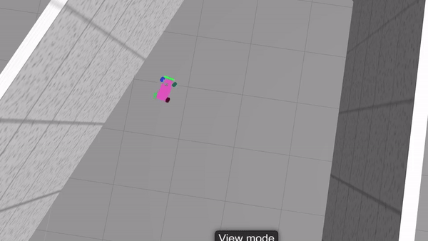

The goal of this project is to provide an easy-to-use framework that will allow to simulate a training of a self-driving car using Gymnasium, ROS 2 and Gazebo. The environment follows the architecture of the openai_ros package that was proposed by The Construct team.

# Software requirements #
* Linux amd64 with Docker Engine and Compose v2, about 15 GB of free disk space
* ROS 2 Lyrical, Gazebo Jetty, Python 3, Gymnasium and PyTorch (all installed in the Docker image)
* Optional: an NVIDIA GPU with the [NVIDIA Container Toolkit](https://docs.nvidia.com/datacenter/cloud-native/container-toolkit/latest/install-guide.html)

# Installation #
The whole setup can be found in [Dockerfile](docker/Dockerfile) and [compose.yaml](compose.yaml); [scripts/dev](scripts/dev) drives it:
```bash
./scripts/dev setup      # build image, start container, colcon build, unit tests
```
Source is bind-mounted and colcon uses symlink installation, so Python edits
apply on process restart. Build artifacts go to the ignored `.colcon/` directory.
The container runs with your UID/GID; save data under `/workspace`.

```bash
./scripts/dev check-sim  # drive/steer/reset integration check (simulator required)
./scripts/dev check      # unit tests (no simulator required)
./scripts/dev shell      # development shell
./scripts/dev build      # rebuild after adding package files or dependencies
./scripts/dev down       # stop everything
```

# Start training #
Start MIT racecar simulation in its own terminal:
```bash
./scripts/dev web        # headless Gazebo + browser viewer at http://localhost:8090/
```
Use `./scripts/dev sim` instead of `web` for training without a browser. The world starts paused; the environment advances it.
Only one simulator and one controller may run at a time.

Start training in the second terminal:
```bash
./scripts/dev train <agent name>
```
There are 5 implemented agents: `dqn`, `double_dqn`, `drqn`, `double_drqn` and `ddpg`. The same can be started with `ros2 launch neuroracer_gym_rl start.launch agent:=<agent name>` in `./scripts/dev shell`.
See [training details](docs/pytorch-training.md).

# WSL and headless setup #
The simulator is headless: Gazebo renders the camera with EGL (on the GPU when the container has one), so no X server is needed.

### Gazebo Web ###
>Gzweb is a WebGL client for Gazebo. Like gzclient, it's a front-end graphical interface to gzserver and provides visualization of the simulation. However, Gzweb is a thin client in comparison, and lets you interact with the simulation from the comfort of a web browser. This means cross-platform support, minimal client-side installation, and support for mobile devices.
>[Gzweb](http://gazebosim.org/gzweb.html)

`./scripts/dev web` serves it at `http://localhost:8090`, and `./scripts/dev vnc` the full Gazebo desktop (see [visualization](docs/visualization.md)).


# Docker #
The development container is built locally by `./scripts/dev setup`. Jupyter Lab runs in it with
```bash
./scripts/dev notebook
```
where `http://localhost:8090` is Gazebo Web and `http://localhost:8888` is Jupyter Lab. There is also an example notebook:
http://localhost:8888/lab/tree/q_learning.ipynb

Note: training uses CUDA when the container has an NVIDIA GPU (`compose.gpu.yaml` is added automatically), and the CPU otherwise.


<!---
windows xserver for camera
process has died exit code -9: The script needed too much memory
laser bug.
simulation start delay
--->
